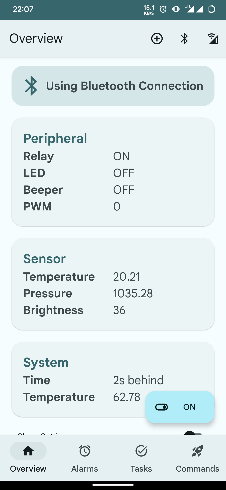
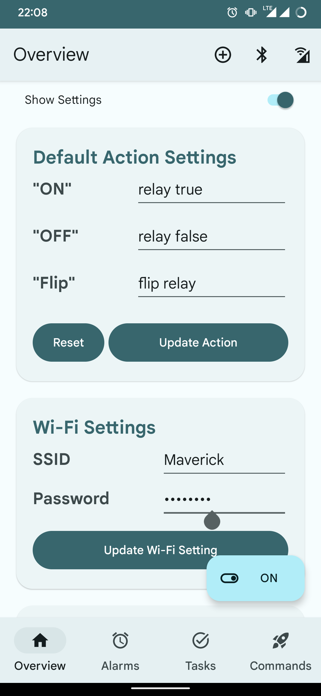
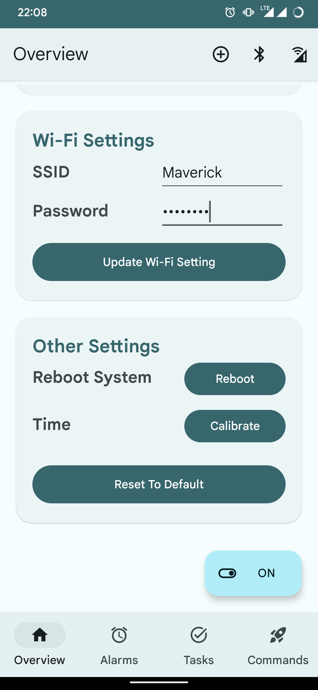
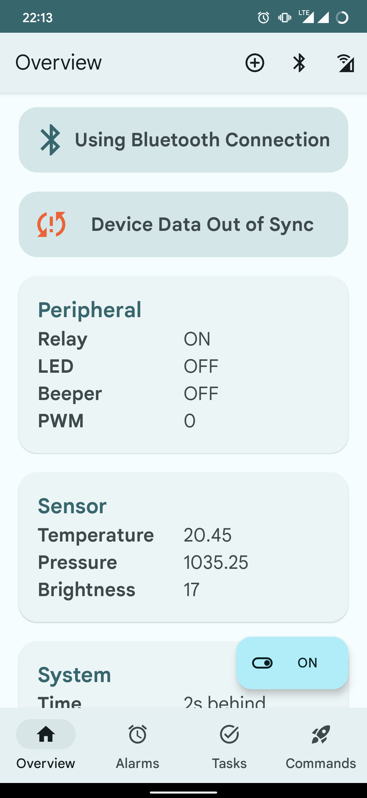
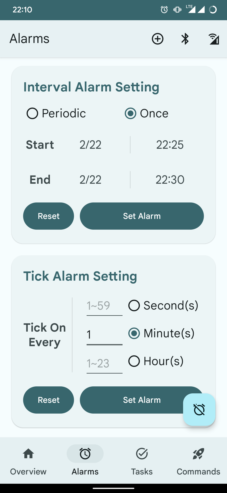
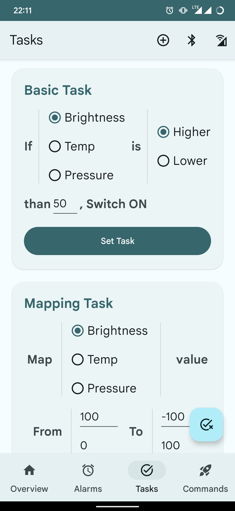
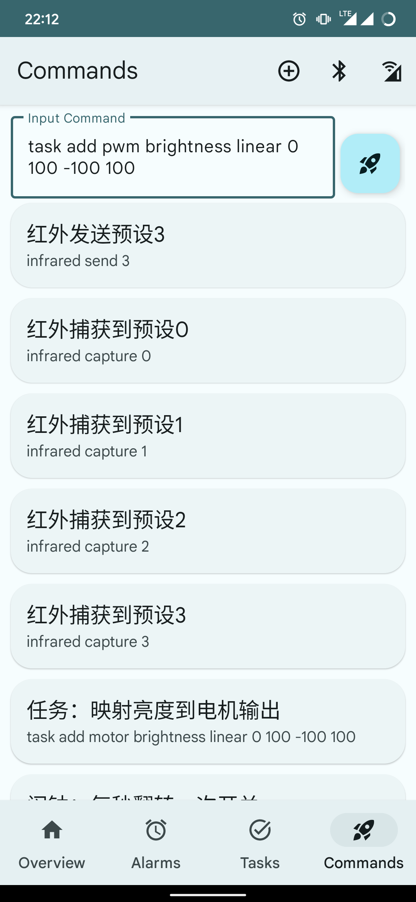

# IoT_Socket_App

This Android App is a part of [**IoT Socket**](https://github.com/gjs990825/IoT_Socket), my
graduation project.

 

# App Running Preview

Testing environment:

    Device: Redmi K20 Pro
    Android Version: 12
    Theme: Material3 Dynamic Colors, light mode

## Overview

Overview fragment, using bluetooth connection.

  

 

Overview, advanced settings - Default Action Settings and Wi-Fi Settings.

  

  
 

Overview, advanced settings - Reboot and Time calibration.

  

 

<!-- Overview, device data out of sync.

  

 -->

## Alarms

Alarms - Interval Alarm and Tick Alarm settings.

  

 

## Tasks

Basic & Mapping Task Setting.

  

 

## Commands

Command input and command list.

  

 
